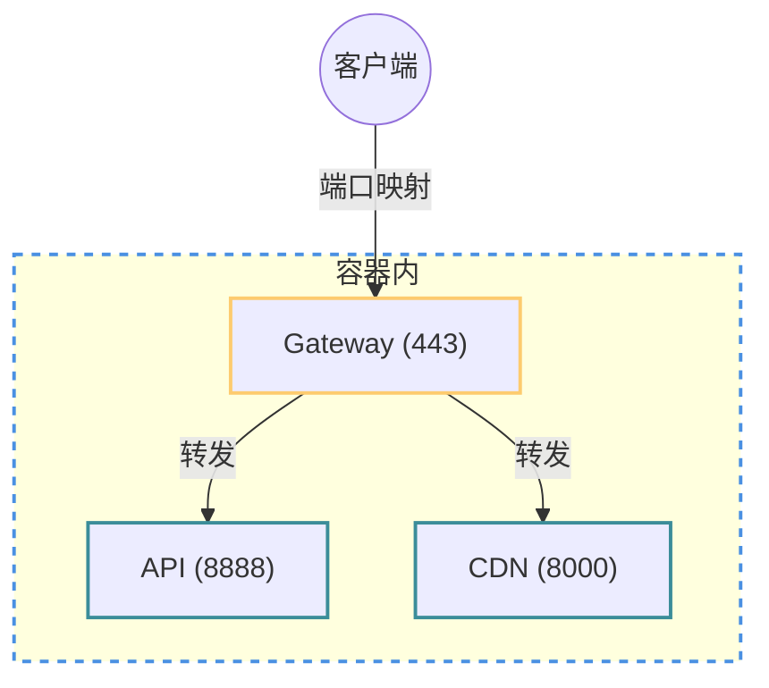
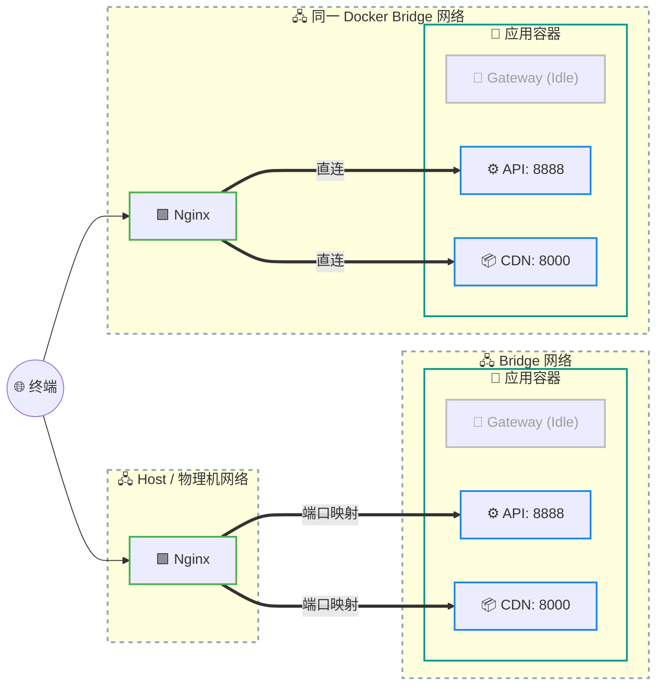

# 容器部署 (Docker)

三个服务（API、CDN、网关）由 `run.py` 统一拉起与守护。

## 架构

### 默认模式



### 自带反代
适用于已有反代的用户，即443已被使用。


### 路径结构

```text
宿主机:

# 仓库目录
Nanaon-Private-Server/
├── data/    # 种子数据库 + 内容目录 JSON (仅构建时读入)
└── var/     # 绑定挂载: 证书、日志、进程状态
    └── db/
        └── private_server.sqlite3   # 活库 (需预建空文件)

# 资源根 (任意位置, 由 RESOURCES_ROOT 指定)
RESOURCES_ROOT/
├── main.5465.com.aniplex.nananiji/assets/
└── com.aniplex.nananiji/files/DownloadCache/

容器内:
/app/
├── app/ # 仓库根
│   ├── data/            # 镜像内容 (JSON 目录); 活库文件
│   ├── seed.sqlite3     # 镜像内种子 (构建时从 data/ 复制, 只读层)
│   └── var/             # 宿主 ./var
├── main.5465.com.aniplex.nananiji/assets/
└── com.aniplex.nananiji/
```

## 构建与启动

```bash
mkdir -p var/db && touch var/db/private_server.sqlite3  # 首次: 预建空文件
docker bake            # 构建镜像
docker compose up -d   # 启动
docker compose logs -f # 查看日志
```

PowerShell 首次启动：

```powershell
New-Item -ItemType Directory -Force var\db | Out-Null
New-Item -ItemType File -Force var\db\private_server.sqlite3 | Out-Null
docker bake
docker compose up -d
docker compose logs -f
```

- 首次启动会在 `var/certs` 生成自签名 TLS 证书（`gateway_trust_cert.pem`）；
- 游戏连接前必须把该证书安装为测试模拟器的 Android 系统 CA。Docker 证书的安装文件名为 `0485b453.0` / `1a6db830.0`；这会扩大该模拟器的信任边界，不应安装到日常使用的真机；
- 活库以文件形式被挂载到容器内(见Compose)；文件为空时，entrypoint 自动重置为默认状态(镜像内`seed.sqlite3`)；已有数据则跳过。重置玩家数据 = 删除该文件后重新 `touch`；
- 静态游戏内容数据在构建时被冻结在镜像中；`var/`（证书、日志、进程状态）挂载到仓库目录，便于直接查看；


### 常用 Bake 命令

```bash
docker buildx bake              # 本地构建并加载镜像
docker buildx bake publish      # 构建并推送镜像到注册表
IMAGE_TAG=v1 docker buildx bake # 指定版本标签
docker buildx bake --print      # 仅打印构建计划
```
